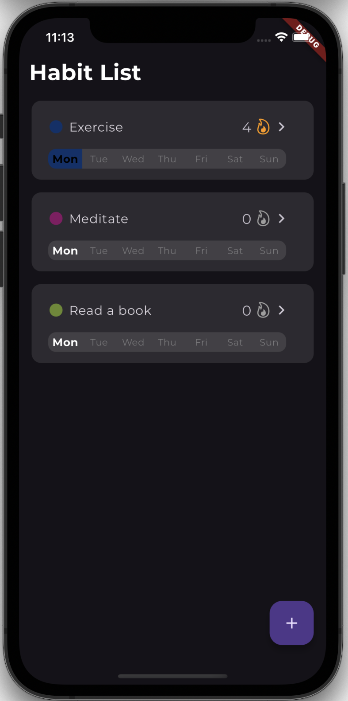

# Habit Tracker App 📅

A simple Flutter app designed to help users track and visualize their daily habits. The app enables users to create custom habits, track progress over time, and maintain streaks for added motivation.

This project was created to learn **Flutter** and **Dart**.

## Features

- **Custom Habit Creation**: Add and edit habits with custom names and colors.
- **Daily Tracking**: Mark your habits as completed each day and see a calendar overview of your progress.
- **Habit Streaks**: Maintain streaks by consistently completing habits to stay motivated.
- **(Planned)** **Streak Freezes**: Get rewarded if you complete your habits often enough in a row or meet other criteria, earning streak freezes (allowing you to maintain streaks even if you miss one day).

## Screenshots




## Installation

To get the Habit Tracker App up and running on your local machine, follow these steps:

### Prerequisites

- **Flutter SDK**: Install the Flutter SDK from [Flutter's official website](https://flutter.dev/docs/get-started/install).
- **Android Studio / Xcode**: Ensure you have either Android Studio or Xcode set up for Android/iOS development.
- **A Device or Emulator**: A physical device or an emulator must be set up for testing the app.

### Steps:

1. **Clone the repository**:

   ```bash
   git clone https://github.com/erik9876/HabitTracker-Flutter
   ```

2. **Navigate to the project directory**:

   ```bash
   cd HabitTracker-Flutter
   ```

3. **Install the dependencies**:
   Run the following command to fetch all the necessary dependencies for the project:

   ```bash
   flutter pub get
   ```

4. **Run the app**:
   - For Android:
     ```bash
     flutter run
     ```
   - For iOS:
     Ensure you have Xcode installed and properly set up. Then, also run:
     ```bash
     flutter run
     ```

## Technologies Used

- **Flutter**: A cross-platform UI toolkit for building natively compiled applications for mobile, web, and desktop.
- **Dart**: The programming language used for Flutter app development.
